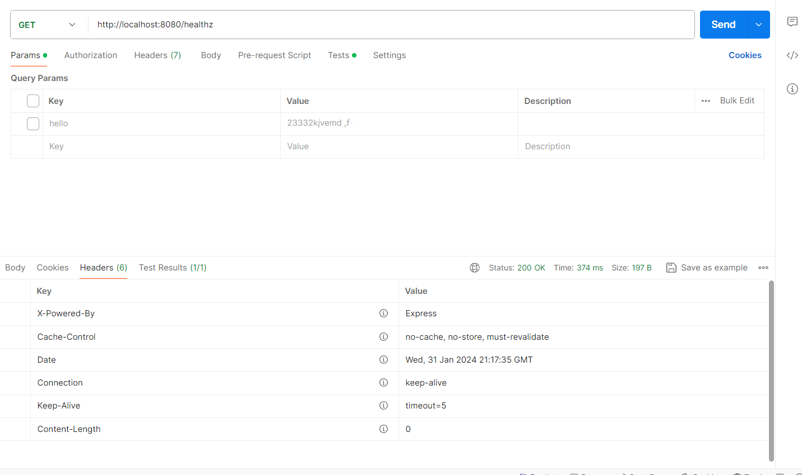
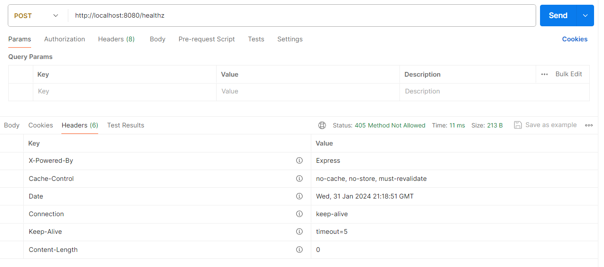
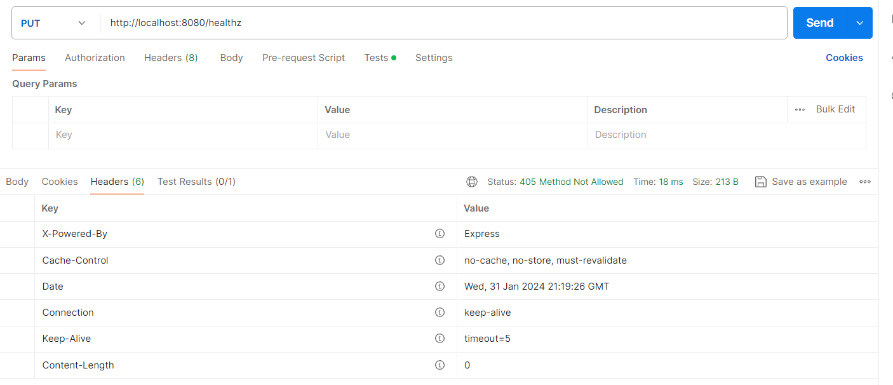
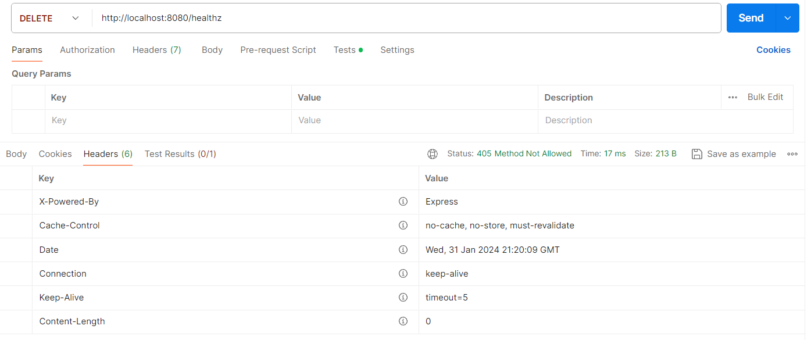
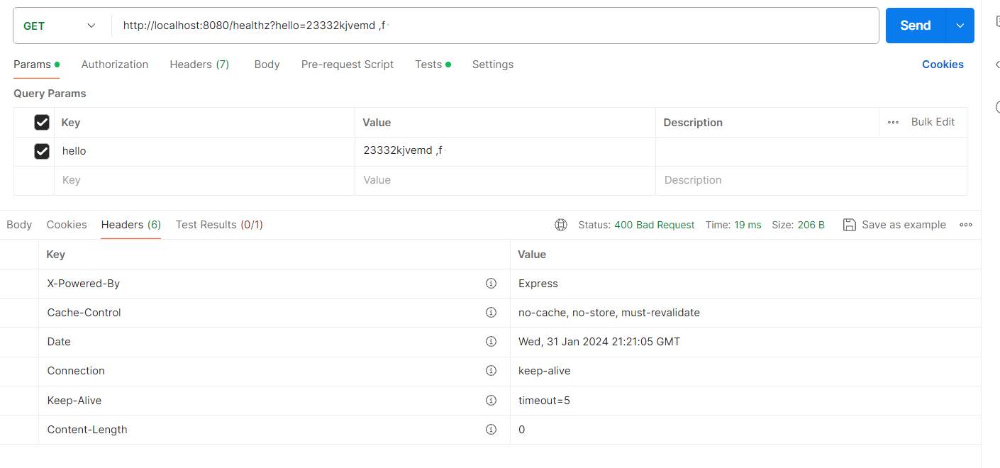
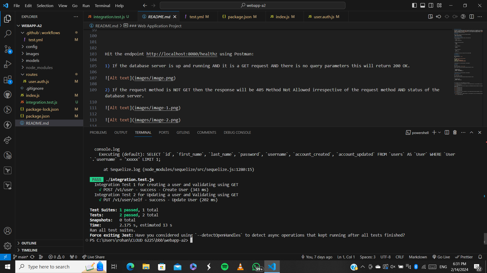
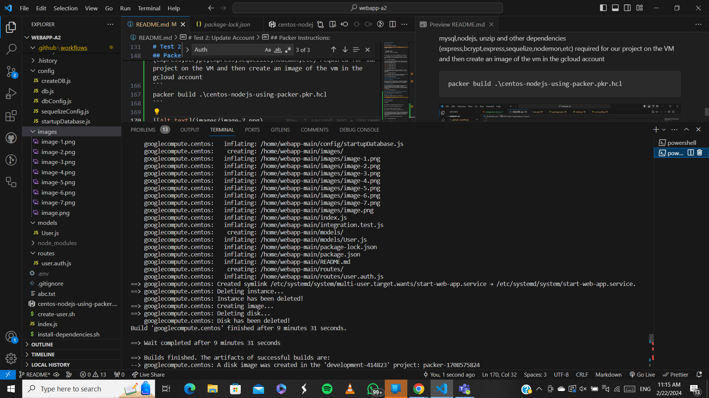
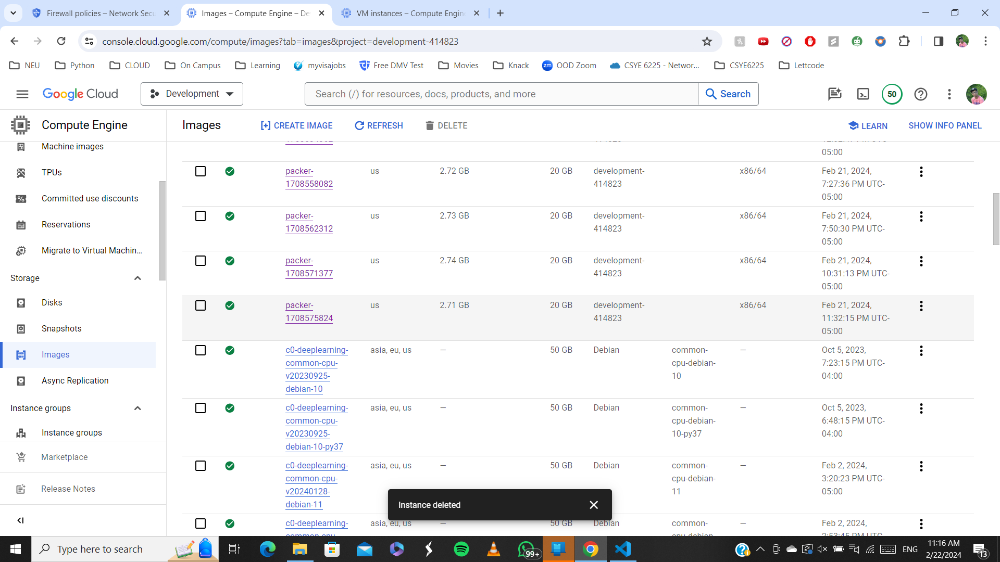

### Web Application Project

This project is a Node.js-based web application that provides a RESTful API for user management. It uses nodemon for reloading during development. It also provides a simple `/healthz` endpoint to check the health of a database connection using Sequelize. It responds with `200 OK` if the database is successfully connected and it is a GET method without any query parameters, `400 Bad Request` if any query parameters are present, and `503 Service Unavailable` if it fails to connect to the database.It returns `405 Method Not Allowed` if the request method is anything other than GET.

## Prerequisites

Before you begin, ensure you have met the following requirements:

- Node.js and npm installed
- MySQL installed and running

## Build and Deploy Instructions

To build and deploy this application locally, follow these steps:

1. Clone the repository:

   ```bash
   git clone <repository-url>

   ```

1. Navigate to the project directory:

   ```bash
   cd webapp

   ```

1. Install dependencies:

   ```bash
   npm install

   ```

1. Start the application:

   ```bash
   nodemon index.js

   ```

1. The application should now be running at http://localhost:3000.

## API Endpoints

# Get User Information

GET /v1/user/self
Sample Success Response: `200 OK`

```bash
{
"id": "d290f1ee-6c54-4b01-90e6-d701748f0851",
"first_name": "Jane",
"last_name": "Doe",
"username": "jane.doe@example.com",
"account_created": "2016-08-29T09:12:33.001Z",
"account_updated": "2016-08-29T09:12:33.001Z"
}
```

Or 400 Bad Request for any request payload or wrong endpoints.

# Create User

POST /v1/user

Sample Success Response: `201 User created`

Mandatory Request body along with BasicAuth Username and Password in format:

```
{
  "first_name": "Jane",
  "last_name": "Doe",
  "password": "skdjfhskdfjhg",
  "username": "jane.doe@example.com"
}
```

Or 400 Bad Request for any request payload or wrong endpoints.

# Update User Information

PUT `/v1/user/self`

User cannot change his username

Mandatory Request body along with BasicAuth Username and Password in format:

```
{
  "first_name": "John",
  "last_name": "Doe",
  "password": "<enter your password>"
}
```

Hit the endpoint http://localhost:8080/healthz using Postman:

1. If the database server is up and running AND it is a GET request AND there is no query parameters this will return 200 OK.



2. If the request method is NOT GET then the response will be 405 Method Not Allowed irrespective of the request method AND status of the database server.








3. If the database server is up and running AND it is a GET request AND there some query parameters, this will return 400 Bad Request.



4.  If the database server is in stopped state AND it is a GET request then, this will return 503 Service Unavailable.


## Integration Tests for /v1/user Endpoint

# Test 1: Create Account

This test verifies the creation of a new account by sending a POST request to the /v1/user endpoint. It then uses a GET call to validate that the created account exists in the database.

# Test 2: Update Account

This test ensures the correct updating of an existing account by first sending a PUT request to update the account information through the /v1/user endpoint. It then utilizes a GET call to verify that the account was successfully updated in the database.



### Install Packer and add it to environment path variables

https://developer.hashicorp.com/packer/install

### Login to GCLOUD:

Run following command and login to Gcloud account:
```
gcloud auth application-default login
```

## Packer Instructions:

Move to webapp project
```
cd webapp
```

Run following to initialize packer for pkr.hcl file
```
packer init .\centos-nodejs-using-packer.pkr.hcl
```

Run following command to validate the packer
```
packer validate .\centos-nodejs-using-packer.pkr.hcl
```

Run following command to start the build. In out case the build will create install mysql,nodejs, unzip and other dependencies (express,bcrypt,express,sequelize,nodemon,etc) required for our project on the VM and then create an image of the vm in the gcloud account
```
packer build .\centos-nodejs-using-packer.pkr.hcl
```




